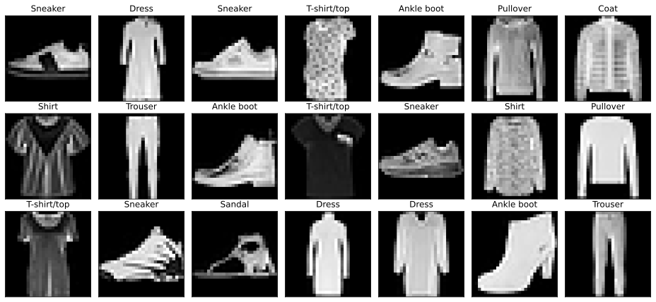
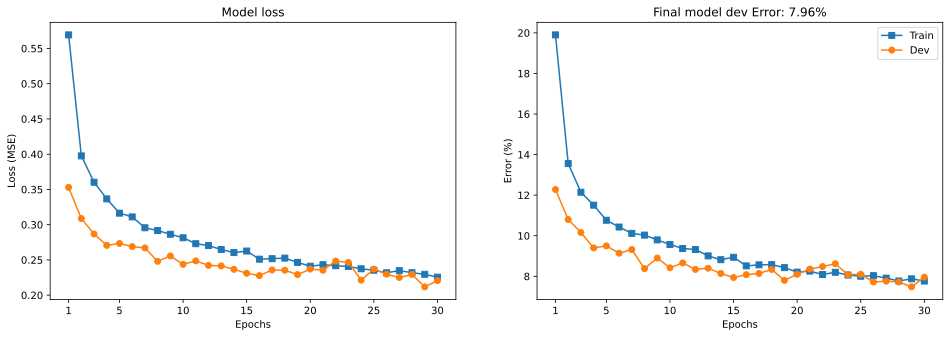

<!-- PROJECT LOGO -->
 

  

  <h3 align="center">AI Project #2: </h3>
  <h3 align="center">Convolutional Neural Network for Image Classification with PyTorch</h3>

  

    by Illia Nesterenko
  

<!-- TABLE OF CONTENTS -->

  
Table of Contents

  <ol>
    <li>
      <a href="#-about-the-project">About The Project</a>
      <ul>
        <li><a href="#-built-with">Built With</a></li>
      </ul>
    </li>
    <li><a href="#-training-and-evaluation">Training and Evaluation</a></li>
    <li><a href="#-retrospective">Retrospective</a></li>
    <li><a href="#-contacts">Contacts</a></li>
  </ol>

<!-- ABOUT THE PROJECT -->
## 🔮 About The Project

<i>A sample from Fashion-MNIST dataset.</i>

This project grew from a task from Mike X Cohen's Deep Learning course on Udemy. The goal is to _**train and evaluate a CNN model for image classification on the Fashoin MNIST dataset**_. In short, I have used PyTorch to download the dataset. Then, I normalized it to a range [0,1], put it in Dataloaders, and experimented with model architecture to achieve 90%+ accuracy. Please, look at _cnn-project.ipynb_ for a walkthrough of each phase. For a summary, check <a href="#-training-and-evaluation">Training and Evaluation</a>.

**NB**: FMNIST is a well-known dataset among practitioners. Thus, the point of this project was not to compile and preprocess data, but to showcase my PyTorch skills. For a more data-oriented project, check out this <a href="https://github.com/illia-nest/web-scrapping-and-ner">one</a>.

Also, when checking Jupiter Notebook for this project, Github may not render the grid with sample images (shown above). This is inconvenient, so I have included the picture here. The rest of the figures look fine. Please, let me know if you have any troubles while checking out the notebook. 

(<a href="#readme-top">back to top</a>)

### 🧰 Built With  
[![pytorch]][pytorch-url]  
[![numpy]][numpy-url]  
[![sklearn]][sklearn-url]  
[![matplotlib]][matplotlib-url]  

(<a href="#readme-top">back to top</a>)

<!-- GETTING STARTED -->
## 💪 Training and Evaluation

First, let's take a look at the model's architecture. Below is the formatted output of the model summary. The output shape is shown as [batch size, no. of filters, image height, image width] for convolution layers and [batch size, no. of neurons] for fully-connected (FC) layers. 

|        Layer (type)         |   Output Shape  |  Param #  |
|-----------------------------|-----------------|-----------|
| Conv2d-1                    | [-1, 24, 28, 28]|       240 |
| BatchNorm2d-2               | [-1, 24, 14, 14]|        48 |
| Conv2d-3                    | [-1, 96, 14, 14]|    20,832 |
| BatchNorm2d-4               | [-1, 96, 7, 7]  |       192 |
| Conv2d-5                    | [-1, 192, 7, 7] |   166,080 |
| BatchNorm2d-6               | [-1, 192, 3, 3] |       384 |
| Linear-7                    | [-1, 512]       |   885,248 |
| Linear-8                    | [-1, 256]       |   131,328 |
| Linear-9                    | [-1, 128]       |    32,896 |
| Linear-10                   | [-1, 10]        |     1,290 |  
---

Total params: 1,238,538  
Trainable params: 1,238,538  
Non-trainable params: 0

---

Input size (MB): 0.00  
Forward/backward pass size (MB): 0.45  
Params size (MB): 4.72  
Estimated Total Size (MB): 5.18

---

The model consists of 3 blocks of convolution-pooling-batchnorm-activation layers followed by 3 FC layers and a final layer with 10 units (1 per class in the dataset). I used ReLU as an activation function and a dropout rate of .25 for conolution and .5 for FC layers. In PyTorch, the softmax is applied within the `CrossEntropyLoss` function, so the model can have 10 outputs later converted into probabilities. Below are two figures that show the progress of training after 30 epochs with batch size equal to 32.

  

We can see that model loss and model error are falling down, which is a good sign. The final error is 7.96% which can be translated into 100 - 7.96 = 92.04% accuracy. Running the model on a test set gives us 92.03% accuracy, which is relatively good result for such architecture.

(<a href="#readme-top">back to top</a>)

<!-- RETROSPECTIVE -->
## 🌟 Retrospective
When I designed the model above I was learning what is convolution and how it works. Now that I have a far better understanding of CNN architectures I can see how this model is so much from the late 1990s. It is similar to LeNet-5 (1998). Were I to make this project today, I would probably use global average pooling for flattening and only one FC layer in the end. I would also use more convolution layers, either depth-wise separable convolutions, or EfficientNet-style residual blocks (however, for such datasets this may be overkill). At the very least I would stack the convolution layer and would not apply pooling as aggressively as I did here. Anyway, I leave the architecture as it is as a reminder to myself "how it all started".

(<a href="#readme-top">back to top</a>)

<!-- CONTACT -->
## ☎️ Contacts

Illia Nesterenko - [Telegram](https://t.me/illia_nest) - [LinkedIn](https://www.linkedin.com/in/illianest/) - illia.nest03@gmail.com

Project Link: [https://github.com/illia-nest/web-scrapping-and-ner](https://github.com/illia-nest/web-scrapping-and-ner)

(<a href="#readme-top">back to top</a>)

<!-- MARKDOWN LINKS & IMAGES -->
[numpy]: https://img.shields.io/badge/numpy-%23013343?style=for-the-badge&logo=numpy
[numpy-url]: https://numpy.org/
[matplotlib]: https://img.shields.io/badge/matplotlib-%230C0057?style=for-the-badge&logo=matplotlib
[matplotlib-url]: https://matplotlib.org/
[sklearn]: https://img.shields.io/badge/scikit--learn-%23223228?style=for-the-badge&logo=scikitlearn
[sklearn-url]: https://scikit-learn..org/
[pytorch]: https://img.shields.io/badge/PyTorch-black?style=for-the-badge&logo=pytorch
[pytorch-url]: https://pytorch.org/
